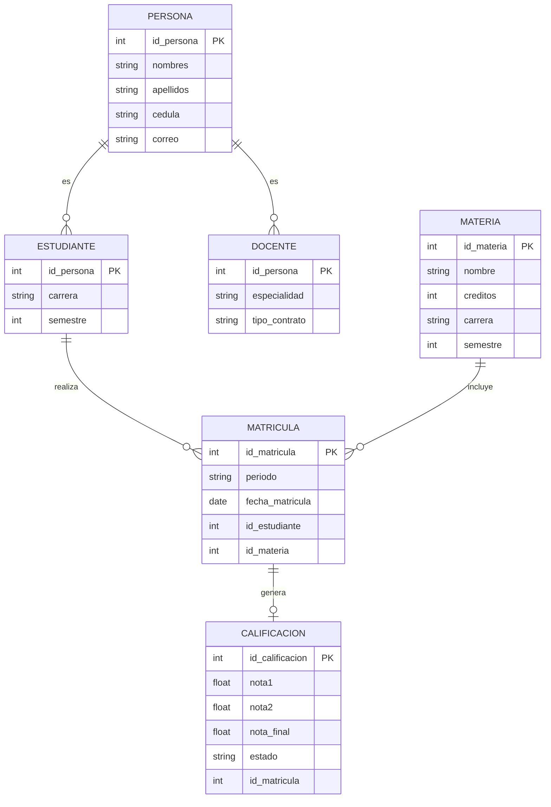

# ORM – Sistema de Gestión Académica

## Restricciones Externas

1. Especialización total:
   Toda PERSONA debe ser ESTUDIANTE o DOCENTE.

2. Regla de negocio:
   Si nota_final >= 7 → estado = "Aprobado"
   Si nota_final < 7 → estado = "Reprobado"